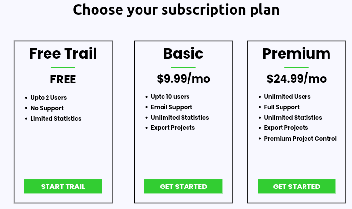

# Subscription Page Template

This is a subscription page template with three plans: Free, Basic, and Premium. You can use this template on your website to offer subscription plans to your users.

## How to Use

1. Copy the HTML code for the subscription page template.
2. Paste the HTML code into your website's HTML file where you want the subscription page to appear.
3. Customize the plan details (price, features, etc.) to match your offerings.
4. Optionally, style the page using CSS to match your website's design.

## Example

Below is an example of how the subscription plans will appear on your website:

## License

Feel free to use and modify this template for your own projects. If you find it helpful, we kindly ask that you leave credits by linking back to this repository or mentioning the source in your code comments.

Happy coding!